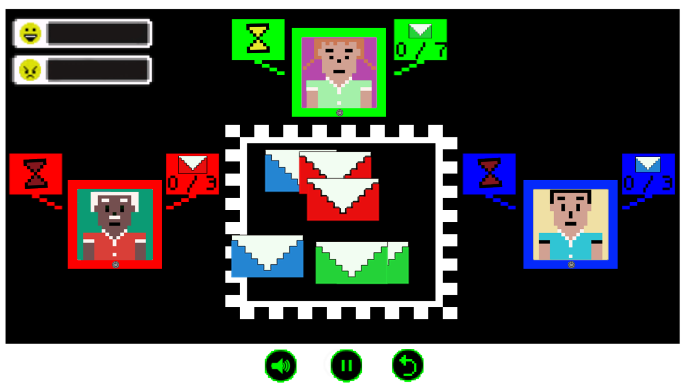

---
layout: default
---  
# Sejam Bem-vindos, ao meu Portifólio
***
# Contatos

  

# _Quem sou eu?_  

**_Nome _:**Elielton Arquimedes de Oliveira Silva  
**_Idade _:**18 anos  
**_Natural de  _:**Ceará-Mirim-RN

**Atualmente curso o 3ªano do curso de Programação de Jogos Digitais do Instituto Federal de Educação,Ciencia e Tecnologia Do Rio Grande do Norte.Campus:Ceará-Mirim.**   
* * * 
# Jogos  na qual criei e participei com meus colegas da turma de PJD3V no ano de 2017  
 
## Games  
1. Akili

* * * 

2. Servidor de mensagens

* * * 

3. PUM

* * * 

4. Profilaxia

* * * 

# Influence map

#Artes

Empresa JAJA:

* * *  

Jogo Akili:

* * *  

Jogo Servidor de mensagens:

* * *  

# Animações:

* * * 

* * * 

* * * 

* * * 

* * * 

* * * 

# Parceiros: JAJA Entertainement and Bizonho Games

  Os voids: elielton90.github.io  
  victor-mesmo.github.io  
  jldifrn.github.io  
  eriksonnicacio.github.io
  
  
* * * 

